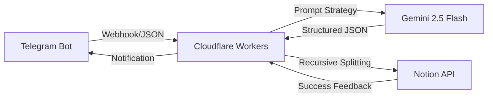

# 🧠 Inspiration-OS: Atomic Inspiration Relay & Architecture System

[English Documentation](#english-version) | [中文文档](#中文文档)

---

## 🚀 Product Definition (English)
An **AI Agent-based** atomic information flow system. It listens to disordered inspirations via Telegram, leverages Gemini 2.5 Flash's deep reasoning to perform auto-titling, classification, and "6-dimensional" architecture analysis, and persists the data into a Notion database.

### 🛠️ System Architecture

### 🔧 Engineering Challenges
* **Breaking Notion API Limits**: Developed a recursive `splitContent` function to bypass the 2000-character limit per block, ensuring zero data loss.
* **Model Stability**: Optimized request headers and locked the `v1beta` endpoint for `Gemini 2.5 Flash`.
* **Data Robustness**: Implemented Regex sanitization to strip Markdown code blocks (e.g., \`\`\`json) from AI responses.

### 📈 Project Review (STAR)
* **S (Situation)**: Fragmented inspirations were difficult to organize and lacked logical depth.
* **T (Task)**: Build an automated relay station to achieve "Input to Architecture" in seconds.
* **A (Action)**: Deployed Cloudflare Workers; engineered "Senior Architect" prompts; resolved Notion integration hurdles.
* **R (Result)**: Successfully launched an L3 AI Agent, enabling minute-level conversion from "random thoughts" to "PRD prototypes."

### ⚙️ Quick Start (English)

#### 1. Environment Variables
| Variable | Description |
| :--- | :--- |
| `API_KEY` | Google Gemini API Key |
| `TELE_TOKEN` | Telegram Bot Token |
| `NOTION_TOKEN` | Notion Internal Integration Token |
| `NOTION_DATABASE_ID` | Notion Database ID |

#### 2. Deployment
1. **Notion**: Create a database with `Name`(Title), `Content`(Text), `Category`(Multi-select), and `Created Time`(Date).
2. **Workers**: Deploy `index.js` and set the variables in Cloudflare dashboard.
3. **Webhook**: Link your Bot via: `https://api.telegram.org/bot<TOKEN>/setWebhook?url=<WORKER_URL>`

---

## 🧠 Inspiration-OS: 原子化灵感中转与架构系统

## 🚀 项目定位 (中文)
一个基于 **AI Agent** 思维的原子化信息流转系统。它通过 Telegram 监听用户输入的乱序灵感，利用 Gemini 2.5 Flash 的深度推理能力，自动完成标题提取、分类判断及“6维度”产品架构梳理，并最终持久化存储至 Notion 数据库。

### 🛠️ 系统架构

### 🔧 核心技术攻关
* **突破 Notion API 字符限制**：开发了 `splitContent` 递归分片函数，将超长字符串自动切割为满足 API 规范的数组块。
* **模型自适应与稳定性**：通过锁定 `v1beta` 路径并适配 `Gemini 2.5 Flash`，解决了接口版本变动导致的调用失效问题。
* **结构化数据容错**：引入正则表达式预处理机制，在解析前自动剔除 AI 可能返回的 Markdown 冗余标记。

### 📈 项目复盘 (STAR)
* **S (背景)**：日常灵感碎片化严重，难以沉淀为有逻辑的方案。
* **T (任务)**：构建全自动中转站，实现“录入即架构”的自动化流转。
* **A (行动)**：部署 Cloudflare Workers 核心路由，编写架构师提示词，攻克 Notion 接口工程坑位。
* **R (结果)**：落地 L3 级 AI Agent，实现从“碎碎念”到“PRD原型”的分钟级转化。

### ⚙️ 快速开始 (中文)

#### 1. 环境变量配置
| 变量名 | 说明 |
| :--- | :--- |
| `API_KEY` | Google Gemini API Key |
| `TELE_TOKEN` | Telegram Bot Token |
| `NOTION_TOKEN` | Notion Internal Integration Token |
| `NOTION_DATABASE_ID` | 目标数据库 ID |

#### 2. 部署步骤
1. **Notion 准备**：创建包含 `Name`(Title), `Content`(Text), `Category`(Multi-select), `Created Time`(Date) 的数据库。
2. **配置变量**：在 Cloudflare 后台配置上述表格中的环境变量。
3. **部署绑定**：部署 `index.js` 代码，并访问 `setWebhook` 链接绑定机器人。

---

**Developed with ❤️ by Light Kise**
