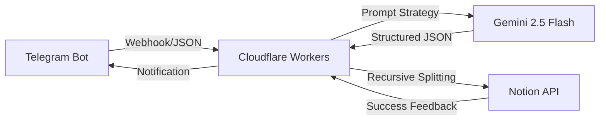

# 🧠 Inspiration-OS: 原子化灵感中转与架构系统

> **"将碎片化的瞬时直觉，转化为可落地的产品架构。"**

---

## 🚀 项目定位 (Product Definition)
一个基于 **AI Agent** 思维的原子化信息流转系统。它通过 Telegram 监听用户输入的乱序灵感，利用 Gemini 2.5 Flash 的深度推理能力，自动完成标题提取、分类判断及“6维度”产品架构梳理，并最终持久化存储至 Notion 数据库。

## 🛠️ 系统架构 (System Architecture)

## 🔧 核心技术攻关 (Engineering Challenges)

### 1. 突破 Notion API 字符限制
- **痛点**：Notion `rich_text` 属性单次写入限制为 2000 字符，而 Gemini 生成的深度架构方案经常达到 3000+ 字符。
- **解法**：开发了 `splitContent` 递归分片函数，将超长字符串自动切割为满足 API 规范的数组块，确保方案完整入库。

### 2. 模型自适应与稳定性优化
- **痛点**：Gemini 不同版本（v1/v1beta）的端点差异易导致 404 错误。
- **解法**：通过锁定 `v1beta` 路径并适配 `Gemini 2.5 Flash`，实现了极高的推理响应稳定性。

### 3. JSON 数据清洗与结构化容错
- **痛点**：LLM 有时会返回带 Markdown 标记的 JSON（如 \`\`\`json），直接解析会导致 `JSON.parse` 抛出异常。
- **解法**：引入了正则表达式预处理机制，在解析前自动剔除冗余标记。

## 📈 项目复盘 (STAR)

* **S (Situation)**: 散落在各处的灵感难以整理，且缺乏逻辑深度。
* **T (Task)**: 构建一个全自动化的灵感处理中转站，实现“录入即架构”。
* **A (Action)**: 
    * 部署 Cloudflare Workers 作为核心路由。
    * 通过自定义 Prompt 让 Gemini 2.5 模拟资深架构师行为。
    * 解决 Notion 属性类型匹配及字符超限等工程坑位。
* **R (Result)**: 成功落地一个 L3 级别的 AI Agent，实现从“碎碎念”到“PRD原型”的分钟级转化。

## ⚙️ 快速开始 (Quick Start)

### 1. 准备工作
- **Notion**: 创建数据库，包含 `Name`(Title), `Content`(Text), `Category`(Multi-select), `Created Time`(Date)。
- **Telegram**: 找 [@BotFather](https://t.me/botfather) 获取 `TELE_TOKEN`。
- **Gemini**: 获取 [Google AI API Key](https://aistudio.google.com/app/apikey)。

### 2. 环境变量配置
在 Cloudflare Workers 配置以下变量：

| 变量名 | 说明 |
| :--- | :--- |
| `API_KEY` | Google Gemini API Key |
| `TELE_TOKEN` | Telegram Bot Token |
| `NOTION_TOKEN` | Notion Internal Integration Token |
| `NOTION_DATABASE_ID` | 目标数据库 ID |

### 3. 部署
将 `index.js` 代码部署至 Cloudflare Workers 并激活 Webhook 即可。

---

**Developed with ❤️ by Light Kise**
