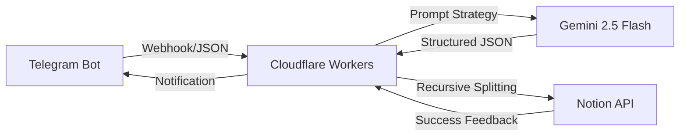
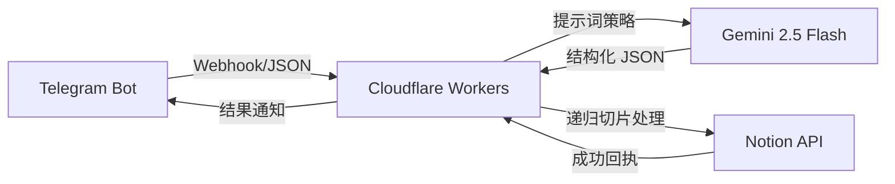

# 🧠 Inspiration-OS: Atomic Inspiration Relay & Architecture System

  <b><a href="#english-version">EN</a></b> | <b><a href="#中文文档">CN</a></b>

---

## 🚀 Product Definition (English)
An **AI Agent-based** atomic information flow system. It listens to disordered inspirations via Telegram, leverages Gemini 2.5 Flash's deep reasoning to perform auto-titling, classification, and "6-dimensional" architecture analysis, and persists the data into a Notion database.

### 🛠️ System Architecture

> **Architecture Logic:** The system operates as a stateless middleware on Cloudflare Workers. It acts as a "Relay Station" that captures asynchronous Telegram events, performs prompt engineering to trigger Gemini's high-order reasoning, and executes recursive write operations to the Notion API, ensuring atomic transaction handling across fragmented data.

### 🔧 Engineering Challenges (Key Takeaways)
* **Recursive Content Chunking**: Notion API strictly limits `rich_text` to 2000 chars. Implemented a recursive `splitContent` function to automate string segmentation, ensuring 100% data integrity for massive PRD outputs.
* **Regex-based JSON Sanitization**: Resolved the "LLM Hallucination Format" issue where models return JSON wrapped in Markdown backticks. Built a sanitization layer to strip redundant markers before parsing.
* **API Version Locking & Stability**: Optimized the Cloudflare Worker core to lock the `v1beta` endpoint for Gemini 2.5, preventing the 404/500 errors caused by rapid model iterations.
* **Multi-Platform Webhook Coordination**: Engineered a robust error-handling mechanism to provide real-time feedback to Telegram when Notion or Gemini services experience latency.

### 📈 Project Review (STAR)
* **S (Situation)**: Fragmented inspirations were difficult to organize and lacked logical depth.
* **T (Task)**: Build an automated relay station to achieve "Input to Architecture" in seconds.
* **A (Action)**: Deployed Cloudflare Workers as the core router; engineered "Senior Architect" prompts; resolved Notion integration hurdles.
* **R (Result)**: Successfully launched an L3 AI Agent, enabling minute-level conversion from "random thoughts" to "PRD prototypes."

### ⚙️ Quick Start (English)

#### 1. Environment Variables
| Variable | Description |
| :--- | :--- |
| `API_KEY` | Google Gemini API Key |
| `TELE_TOKEN` | Telegram Bot Token |
| `NOTION_TOKEN` | Notion Internal Integration Token |
| `NOTION_DATABASE_ID` | Notion Database ID |

#### 2. Deployment Steps
1. **Notion**: Create a database with `Name`(Title), `Content`(Text), `Category`(Multi-select), and `Created Time`(Date).
2. **Workers**: Deploy `index.js` and set the variables in Cloudflare dashboard.
3. **Webhook**: Link your Bot via: `https://api.telegram.org/bot<TOKEN>/setWebhook?url=<WORKER_URL>`

---

## 🧠 Inspiration-OS: 原子化灵感中转与架构系统

## 🚀 项目定位 (中文)
一个基于 **AI Agent** 思维的原子化信息流转系统。它通过 Telegram 监听用户输入的乱序灵感，利用 Gemini 2.5 Flash 的深度推理能力，自动完成标题提取、分类判断及“6维度”产品架构梳理，并最终持久化存储至 Notion 数据库。

### 🛠️ 系统架构

> **架构逻辑解析：** 系统采用无状态的 Cloudflare Workers 作为核心中间件，构建了一个高效的“灵感中继站”。它负责捕获 Telegram 的异步事件，通过提示词工程触发 Gemini 的高阶推理，并针对 Notion API 的物理限制执行递归写入，确保了碎片化数据在跨平台流转过程中的原子性与完整性。

### 🔧 核心技术攻关 (关键总结)
* **Notion API 递归分片算法**：针对 Notion 字符限制（2000字/块）痛点，自研递归分片函数，实现长文档自动切割与顺序写入，确保深度架构方案无损沉淀。
* **结构化数据“脏数据”清洗**：通过正则拦截器自动剔除 LLM 返回的 Markdown 伪代码块标识（如 \`\`\`json），彻底解决 JSON 解析崩溃问题。
* **API 稳定性与版本锁死**：针对 Google AI API 频繁更新的风险，封装统一 Request Header 并锁定 `v1beta` 路径，保证了系统在模型迭代下的高可用性。
* **异步通讯与反馈闭环**：在 Cloudflare Workers 层实现了多阶段错误捕获，确保在 Notion API 抖动或 Gemini 响应延迟时，用户能在 Telegram 端收到精准报错提示。

### 📈 项目复盘 (STAR)
* **S (背景)**：日常灵感碎片化严重，难以沉淀为有逻辑的方案。
* **T (任务)**：构建全自动中转站，实现“录入即架构”的自动化流转。
* **A (行动)**：部署 Cloudflare Workers 核心路由，编写架构师提示词，攻克 Notion 接口工程坑位。
* **R (结果)**：落地 L3 级 AI Agent，实现从“碎碎念”到“PRD原型”的分钟级转化。

### ⚙️ 快速开始 (中文)

#### 1. 环境变量配置
| 变量名 | 说明 |
| :--- | :--- |
| `API_KEY` | Google Gemini API Key |
| `TELE_TOKEN` | Telegram Bot Token |
| `NOTION_TOKEN` | Notion Internal Integration Token |
| `NOTION_DATABASE_ID` | 目标数据库 ID |

#### 2. 部署步骤
1. **Notion 准备**：创建包含 `Name`, `Content`, `Category`, `Created Time` 的数据库。
2. **配置变量**：在 Cloudflare 后台配置上述表格中的环境变量。
3. **部署绑定**：部署 `index.js` 代码，并访问 `setWebhook` 链接绑定机器人。

---

**Developed with ❤️ by Light Kise**

**MIT License © 2026 Light Kise**
