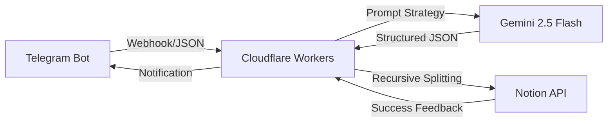

# 🧠 Inspiration-OS: Atomic Inspiration Relay & Architecture System

  <a href="#-inspiration-os-原子化灵感中转与架构系统">中文版</a> | 
  <a href="#-inspiration-os-atomic-inspiration-relay--architecture-system">English</a>

> **"Transforming fragmented instant intuitions into actionable product architectures."**

---

## 🚀 Product Definition
An **AI Agent-based** atomic information flow system. It listens to disordered inspirations via Telegram, leverages Gemini 2.5 Flash's deep reasoning to perform auto-titling, classification, and "6-dimensional" architecture analysis, and persists the data into a Notion database.

## 🛠️ System Architecture

## 🔧 Engineering Challenges

### 1. Breaking Notion API Character Limits
- **Pain Point**: Notion's `rich_text` property has a 2000-character limit per block, while AI-generated architectures often exceed 3000+.
- **Solution**: Developed a recursive `splitContent` function to segment long strings into API-compliant arrays, ensuring zero data loss.

### 2. Model Adaptability & Stability
- **Pain Point**: Differences in Gemini endpoints (v1/v1beta) often lead to 404 errors.
- **Solution**: Locked the `v1beta` path and optimized request headers for `Gemini 2.5 Flash`, achieving high inference stability.

### 3. JSON Sanitization & Robustness
- **Pain Point**: LLMs occasionally return JSON wrapped in Markdown tags (e.g., \`\`\`json), causing `JSON.parse` to crash.
- **Solution**: Implemented a Regex-based pre-processing layer to strip redundant markers, ensuring atomic data flow between platforms.

## 📈 Project Review (STAR)
- **S (Situation)**: Fragmented inspirations were difficult to organize and lacked logical depth.
- **T (Task)**: Build an automated relay station to achieve "Input to Architecture" in seconds.
- **A (Action)**: Deployed Cloudflare Workers as the core router; engineered prompts for "Senior Architect" behavior; resolved Notion API integration hurdles.
- **R (Result)**: Successfully launched an L3 AI Agent, enabling minute-level conversion from "random thoughts" to "PRD prototypes."

---

## 🧠 Inspiration-OS: 原子化灵感中转与架构系统

## 🚀 项目定位 (Product Definition)
一个基于 **AI Agent** 思维的原子化信息流转系统。它通过 Telegram 监听用户输入的乱序灵感，利用 Gemini 2.5 Flash 的深度推理能力，自动完成标题提取、分类判断及“6维度”产品架构梳理，并最终持久化存储至 Notion 数据库。

## 🛠️ 核心技术攻关 (Engineering Challenges)

### 1. 突破 Notion API 字符限制
- **解法**：开发了 `splitContent` 递归分片函数，将超长字符串自动切割为满足 API 规范的数组块，确保方案完整入库。

### 2. 模型自适应与稳定性优化
- **解法**：通过锁定 `v1beta` 路径并适配 `Gemini 2.5 Flash`，实现了极高的推理响应稳定性。

### 3. JSON 数据清洗与结构化容错
- **解法**：引入正则表达式预处理机制，在解析前自动剔除冗余标记，确保数据流在平台间转换的原子性。

## ⚙️ Quick Start / 快速开始

### 1. Environment Variables / 环境变量
| Variable | Description / 说明 |
| :--- | :--- |
| `API_KEY` | Google Gemini API Key |
| `TELE_TOKEN` | Telegram Bot Token |
| `NOTION_TOKEN` | Notion Internal Integration Token |
| `NOTION_DATABASE_ID` | Notion Database ID |

### 2. Deployment / 部署
1. **Notion**: Create a database with `Name`(Title), `Content`(Text), `Category`(Multi-select), `Created Time`(Date).
2. **Workers**: Deploy `index.js` to Cloudflare Workers and set variables.
3. **Webhook**: `https://api.telegram.org/bot<TOKEN>/setWebhook?url=<WORKER_URL>`

---

**Developed with ❤️ by Light Kise**
